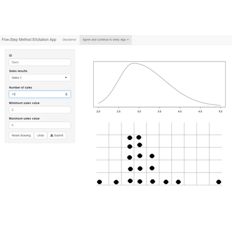
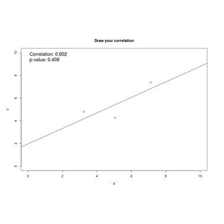
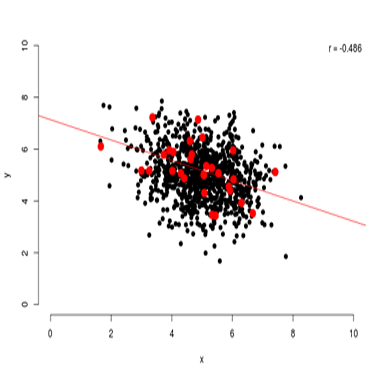

---
---
<link rel="stylesheet" href="styles.css" type="text/css">

### Shiny applications - Click on the figures to go to the apps

##### Kullback-Leibler divergence
This application shows a visual representation of Kullback-Leibler (KL) Divergence. It was created to support the explanation of KL divergence in the manuscript "Using the Data Agreement Criterion to Rank Experts' Beliefs"

 

##### Five-Step Elicitation Tool
This application can be used in a <a href="doc/proposal_for_a_five_step_method.pdf" target="_blank" rel="noopener">Five-Step method elicitation procedure</a>. 

 

##### Effects-Coding simulation tool
This shiny web application is developed to accompany the manuscript 'Effects Coding as Unbiased Alternative to Scale Scores'. Using this application you can play around with setting parameter values for a 2 factor Confirmatory Factor Analysis. You can also add unobserved bias to the model to see what this does to your the estimation. 

 

##### Effects-Coding calculation
This shiny web application is developed such that you can calculate your own factor score model using the Effects-Coding parametrisation. 

 

##### Correlational statistics
This application was developed for educational purposes. Draw your own bivariate distribution and see what correlations and regression models you would find. See for yourself what adding an outlier will do if you have little data for instance. 

 

 

##### Sampling Correlations
This application was developed for educational purposes. It shows sampling from a bivariate distribution under different sample sizes and true correlations. The application also shows the history or sampling distribution for both the correlation statistic and its p-value if multiple samples from the same population are drawn.