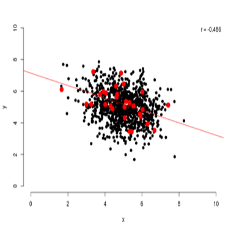

---
---
<link rel="stylesheet" href="styles.css" type="text/css">

### Shiny applications

##### Kullback-Leibler divergence
This application shows a visual representation of Kullback-Leibler (KL) Divergence. It was created to support the explanation of KL divergence in the manuscript "Using the Data Agreement Criterion to Rank Experts' Beliefs"

 

 

##### Sampling Correlations
This application was developed for educational purposes. It shows sampling from a bivariate distribution under different sample sizes and true correlations. The application also shows the history or sampling distribution for both the correlation statistic and its p-value if multiple samples from the same population are drawn.

 

##### Five-Step Elicitation Tool
This application can be used in a <a href="doc/proposal_for_a_five_step_method.pdf" target="_blank" rel="noopener">Five-Step method elicitation procedure</a>. 

